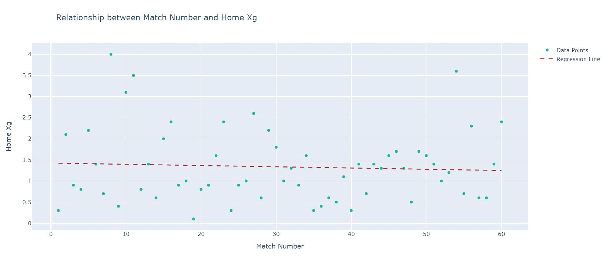

# LinearRegressionWebApp

This is a Linear Regression Application for EN.601.464/664

This Application has multiple pages

## Explore Your Own Dataset

You may upload a .csv file containing data points. It should be formatted as follows:
    
Each row contain the independent (x) and dependent (y) variable of a data point.
The first column contains the independent variable (x) of data points.
The second contains the dependent variable (y) of data points.
The data set should be of size nx2, where n is the total number of data points.
    
| Independent Variable | Dependent Variable |
|----------------------|--------------------|
| x1         | y1       |
| x2         | y2       |
 | ...                  | ...                |
| xn         | yn       |

This will plot the points and allow you to enter an equation of the line and get the errors of the line compared to the data set.

## Explore Relationships

  Select from a variety of datasets from the dropdown menu

Each dataset is imported from Kaggle.com and contains a variety of data points.
The data is cleaned and formatted to be used in the app.
The data is then used to create a custom linear regression model.
    

Current Datasets:
    
FIFA 2022 World Cup Data, Avocado Prices Data, World Happiness Report, Boston Housing Data
      
## Experiement With Custom Parameters

You may upload a .csv file containing data points. It should be formatted as follows:
    
Each row contain the independent (x) and dependent (y) variable of a data point.
The first column contains the independent variable (x) of data points.
The second contains the dependent variable (y) of data points.
The data set should be of size nx2, where n is the total number of data points.

This will plot your points and will run gradient descent allowing you to change the number of epochs and learning rate.
It also allows you to change the intial guesses for slope and intercept.

